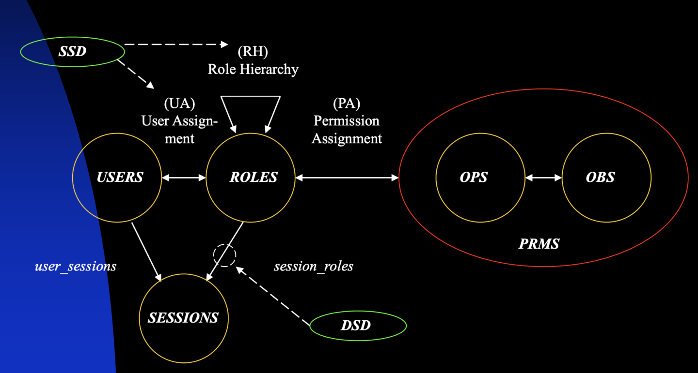

### 1.实验平台

Ubuntu 16.04 LTS，内核linux-4.4.220。

### 2.模块介绍

- LSM模块：Linux安全模块（LSM）是Linux内核的一个轻量级通用访问控制框架，但在内核2.6.x后，LSM模块不再运行动态加载到内核，而需要将模块编译进内核，于是需要编写Makefile以及Kconfig，除linux-4.4.220/security/GomoLSM中的Makefile和Kconfig可以直接复制使用外，linux-4.4.220/security中的Makefile以及Kconfig应该在当前内核源码所提供的内容上添加。
- 角色管理：通过role_manager进行角色管理，包括创建、删除、修改角色和权限，其中模块控制权限只针对文件创建与文件重命名这2个操作提供访问控制，为0表示不允许，为1表示允许；以及模块启用与关闭，如果为Disable，该模块不干预访问控制，当为Enable时才干预访问控制。

### 3.文件介绍

demo中为角色管理程序，以及测试文件；etc中为记录角色和权限的文件；linux-4.4.220中为LSM访问控制模块以及编译配置文件。

### 4.RBAC

